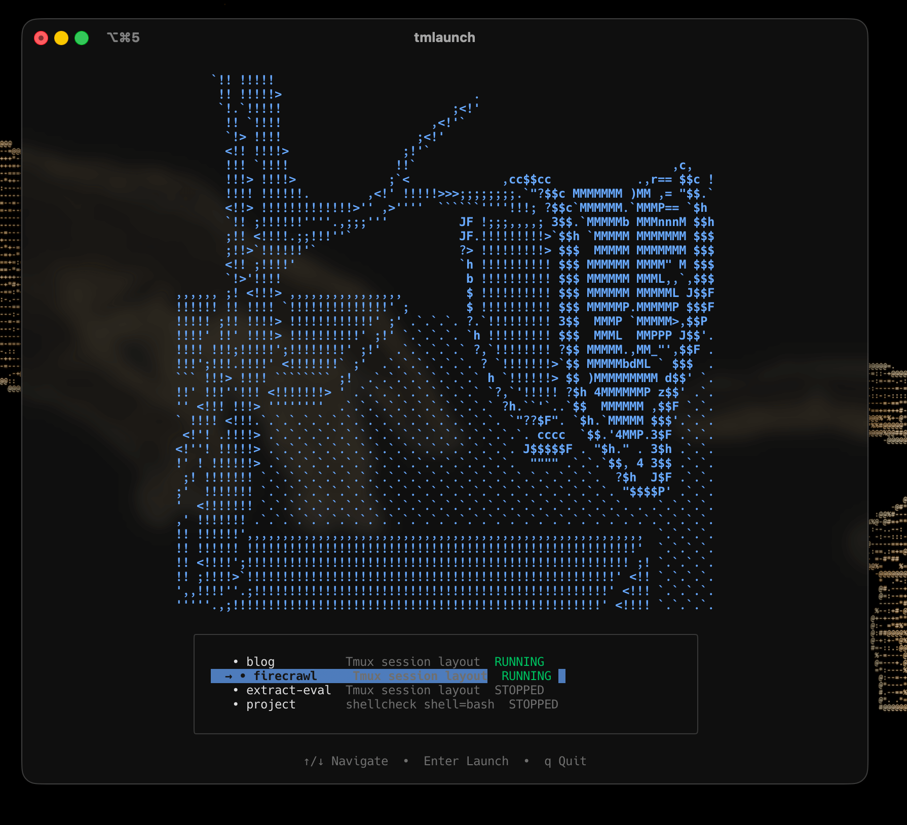

# warpp

Warp into your tmux sessions. A beautiful terminal UI for managing and launching tmuxifier sessions with live previews and animated ASCII art.



## Features

- **Live Session Previews** - See what's happening in your sessions in real-time
- **Animated ASCII Art** - Firecrawl-style fire animation header
- **Claude Code Detection** - Shows spinner when Claude is executing in a session
- **Worktree Support** - Create git worktree sessions on the fly
- **Themeable** - Multiple color themes included
- **Smart Sorting** - Running sessions appear first

## Prerequisites

- [tmux](https://github.com/tmux/tmux) - Terminal multiplexer
- [tmuxifier](https://github.com/jimeh/tmuxifier) - Tmux session management tool
- Go 1.21+ (for building from source)

## Installation

```bash
# Clone the repository
git clone <repository-url>
cd warpp

# Build and install
make install
```

This installs `warpp` to `/usr/local/bin/`. If `wp` command doesn't exist on your system, it also creates a `wp` symlink for convenience.

## Usage

```bash
warpp                  # Launch the TUI interface
warpp --new, -n        # Create new session in current directory
warpp config           # Show current configuration
warpp init-config      # Create default config file
warpp test-ascii       # Test current ASCII art setting
warpp --help           # Show help
warpp --version        # Show version
```

### TUI Controls

- `↑/↓` or `k/j` - Navigate between sessions
- `Enter` - Launch/attach to selected session
- `K` - Kill selected session (with confirmation)
- `n` - Create new session in current directory
- `q` or `Ctrl+C` - Quit

## Configuration

Config file location: `~/.config/warpp/config.json`

```json
{
  "theme": "carbonfox",
  "ascii_art": "fire"
}
```

### Available Themes

- `default` - Clean, minimal theme
- `carbonfox` - Dark theme with blue accents
- `kanagawa` - Warm, nature-inspired theme

### ASCII Art

ASCII art animations are stored in `~/.config/warpp/ascii-art/`. Each animation is a folder containing numbered frames:

```
~/.config/warpp/ascii-art/
  fire/
    01.txt
    02.txt
    ...
  blocks/
    1.txt
```

Available animations: `fire`, `blocks`, `minimal`

## How it Works

1. **Scans** your `~/.tmuxifier/layouts/` directory for `.session.sh` files
2. **Checks** which sessions are currently running via `tmux list-sessions`
3. **Displays** all sessions with live previews in a beautiful TUI
4. **Launches** selected sessions using `tmuxifier load-session`
5. **Attaches** to the session (or switches if already in tmux)

## Worktree Sessions

When launching a layout that's already running, warpp offers to create a git worktree session:

1. Enter a session name (e.g., `myproject-feature`)
2. Enter a branch name (e.g., `feature/new-thing`)
3. warpp creates the worktree and launches a new session in it

## License

MIT License
